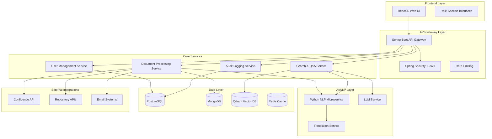
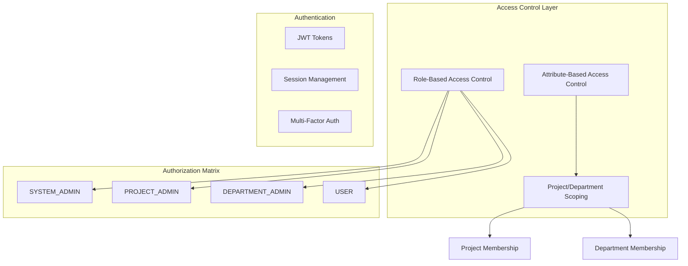

# Synapse AI Agent - Design Document

## Overview

Synapse is a multilingual AI-powered knowledge management system that automates information extraction and synthesis from internal documents and project systems. The system provides intelligent search capabilities and context-aware Q&A functionality with granular role-based access control and comprehensive audit logging.

The architecture builds upon the existing tech stack: Java/Spring Boot backend, ReactJS frontend, Python NLP microservices, with MongoDB for document storage, PostgreSQL for user management and audit logs, and Qdrant/Weaviate for vector embeddings.

## Architecture

### High-Level Architecture



### Security Architecture



## Components and Interfaces

### 1. User Management Service

**Responsibilities:**
- User registration and authentication
- Role assignment and management
- Project/department membership management
- Permission validation

**Key Interfaces:**
```java
@RestController
public class UserController {
    @PostMapping("/api/users/register")
    ResponseEntity<UserDto> registerUser(@RequestBody RegisterRequest request);
    
    @PostMapping("/api/users/{userId}/roles")
    ResponseEntity<Void> assignRole(@PathVariable UUID userId, @RequestBody RoleAssignmentRequest request);
    
    @PostMapping("/api/users/{userId}/projects")
    ResponseEntity<Void> assignProject(@PathVariable UUID userId, @RequestBody ProjectAssignmentRequest request);
    
    @PostMapping("/api/users/{userId}/departments")
    ResponseEntity<Void> assignDepartments(@PathVariable UUID userId, @RequestBody DepartmentAssignmentRequest request);
    
    @PutMapping("/api/users/{userId}/status")
    ResponseEntity<Void> updateUserStatus(@PathVariable UUID userId, @RequestBody StatusUpdateRequest request);
    
    @DeleteMapping("/api/users/{userId}")
    ResponseEntity<Void> softDeleteUser(@PathVariable UUID userId);
}

@RestController
public class ProjectController {
    @PostMapping("/api/projects")
    ResponseEntity<ProjectDto> createProject(@RequestBody CreateProjectRequest request);
    
    @PutMapping("/api/projects/{projectId}/status")
    ResponseEntity<Void> updateProjectStatus(@PathVariable UUID projectId, @RequestBody StatusUpdateRequest request);
    
    @DeleteMapping("/api/projects/{projectId}")
    ResponseEntity<Void> softDeleteProject(@PathVariable UUID projectId);
}

@RestController
public class DepartmentController {
    @PostMapping("/api/departments")
    ResponseEntity<DepartmentDto> createDepartment(@RequestBody CreateDepartmentRequest request);
    
    @PutMapping("/api/departments/{departmentId}/status")
    ResponseEntity<Void> updateDepartmentStatus(@PathVariable UUID departmentId, @RequestBody StatusUpdateRequest request);
    
    @DeleteMapping("/api/departments/{departmentId}")
    ResponseEntity<Void> softDeleteDepartment(@PathVariable UUID departmentId);
}
```

### 2. Document Processing Service

**Responsibilities:**
- Document ingestion from multiple sources
- Content extraction and preprocessing
- Multilingual text processing
- Chunk generation and embedding creation
- Access control metadata assignment

**Key Interfaces:**
```java
@RestController
public class DocumentController {
    @PostMapping("/api/documents/upload")
    ResponseEntity<DocumentDto> uploadDocument(@RequestParam MultipartFile file, 
                                             @RequestBody DocumentMetadata metadata);
    
    @PostMapping("/api/documents/ingest/confluence")
    ResponseEntity<Void> ingestConfluence(@RequestBody ConfluenceConfig config);
    
    @PostMapping("/api/documents/ingest/repository")
    ResponseEntity<Void> ingestRepository(@RequestBody RepositoryConfig config);
    
    @PutMapping("/api/documents/{documentId}/status")
    ResponseEntity<Void> updateDocumentStatus(@PathVariable String documentId, @RequestBody StatusUpdateRequest request);
    
    @DeleteMapping("/api/documents/{documentId}")
    ResponseEntity<Void> softDeleteDocument(@PathVariable String documentId);
}
```

### 3. Search & Q&A Service

**Responsibilities:**
- Multilingual query processing
- Semantic search across vector embeddings
- Context-aware answer generation
- Access control enforcement
- Result ranking and filtering

**Key Interfaces:**
```java
@RestController
public class SearchController {
    @PostMapping("/api/search")
    ResponseEntity<SearchResponse> search(@RequestBody SearchRequest request);
    
    @PostMapping("/api/qa")
    ResponseEntity<QAResponse> askQuestion(@RequestBody QARequest request);
    
    @PostMapping("/api/search/feedback")
    ResponseEntity<Void> provideFeedback(@RequestBody FeedbackRequest request);
}
```

### 4. Audit Logging Service

**Responsibilities:**
- Activity tracking and logging
- Audit trail generation
- Compliance reporting
- Suspicious activity detection

**Key Interfaces:**
```java
@RestController
public class AuditController {
    @GetMapping("/api/audit/logs")
    ResponseEntity<Page<AuditLog>> getAuditLogs(@RequestParam AuditSearchCriteria criteria);
    
    @GetMapping("/api/audit/reports")
    ResponseEntity<AuditReport> generateReport(@RequestParam ReportCriteria criteria);
}
```

### 5. Python NLP Microservice

**Responsibilities:**
- Multilingual text embedding generation
- Language detection and translation
- Text preprocessing and chunking
- Named entity recognition

**Key Interfaces:**
```python
@app.route('/api/nlp/embed', methods=['POST'])
def generate_embedding():
    # Generate multilingual embeddings
    
@app.route('/api/nlp/translate', methods=['POST'])
def translate_text():
    # Translate between supported languages
    
@app.route('/api/nlp/detect-language', methods=['POST'])
def detect_language():
    # Detect input language
```

## Data Models

### PostgreSQL Schema

```sql
-- Users and Authentication
CREATE TABLE users (
    user_id UUID PRIMARY KEY DEFAULT gen_random_uuid(),
    username VARCHAR(255) UNIQUE NOT NULL,
    email VARCHAR(255) UNIQUE NOT NULL,
    password_hash VARCHAR(255) NOT NULL,
    status VARCHAR(50) DEFAULT 'ACTIVE', -- ACTIVE, INACTIVE
    deleted BOOLEAN DEFAULT FALSE, -- soft delete flag
    created_at TIMESTAMP DEFAULT CURRENT_TIMESTAMP,
    updated_at TIMESTAMP DEFAULT CURRENT_TIMESTAMP
);

-- Roles
CREATE TABLE roles (
    role_id UUID PRIMARY KEY DEFAULT gen_random_uuid(),
    name VARCHAR(100) UNIQUE NOT NULL,
    description TEXT,
    permissions JSONB
);

-- User Role Assignments
CREATE TABLE user_roles (
    user_id UUID REFERENCES users(user_id),
    role_id UUID REFERENCES roles(role_id),
    assigned_at TIMESTAMP DEFAULT CURRENT_TIMESTAMP,
    PRIMARY KEY (user_id, role_id)
);

-- Projects
CREATE TABLE projects (
    project_id UUID PRIMARY KEY DEFAULT gen_random_uuid(),
    name VARCHAR(255) NOT NULL,
    description TEXT,
    status VARCHAR(50) DEFAULT 'ACTIVE', -- ACTIVE, INACTIVE
    deleted BOOLEAN DEFAULT FALSE, -- soft delete flag
    created_at TIMESTAMP DEFAULT CURRENT_TIMESTAMP,
    updated_at TIMESTAMP DEFAULT CURRENT_TIMESTAMP
);

-- Departments
CREATE TABLE departments (
    department_id UUID PRIMARY KEY DEFAULT gen_random_uuid(),
    name VARCHAR(255) NOT NULL,
    description TEXT,
    status VARCHAR(50) DEFAULT 'ACTIVE', -- ACTIVE, INACTIVE
    deleted BOOLEAN DEFAULT FALSE, -- soft delete flag
    created_at TIMESTAMP DEFAULT CURRENT_TIMESTAMP,
    updated_at TIMESTAMP DEFAULT CURRENT_TIMESTAMP
);

-- User Project Assignments (one project per user)
CREATE TABLE user_projects (
    user_id UUID REFERENCES users(user_id),
    project_id UUID REFERENCES projects(project_id),
    assigned_at TIMESTAMP DEFAULT CURRENT_TIMESTAMP,
    PRIMARY KEY (user_id)
);

-- User Department Assignments (multiple departments per user)
CREATE TABLE user_departments (
    user_id UUID REFERENCES users(user_id),
    department_id UUID REFERENCES departments(department_id),
    assigned_at TIMESTAMP DEFAULT CURRENT_TIMESTAMP,
    PRIMARY KEY (user_id, department_id)
);

-- Audit Logs
CREATE TABLE audit_logs (
    log_id UUID PRIMARY KEY DEFAULT gen_random_uuid(),
    user_id UUID REFERENCES users(user_id),
    action_type VARCHAR(100) NOT NULL,
    resource_type VARCHAR(100),
    resource_id VARCHAR(255),
    details JSONB,
    ip_address INET,
    user_agent TEXT,
    timestamp TIMESTAMP DEFAULT CURRENT_TIMESTAMP
);
```

### MongoDB Schema

```javascript
// Documents Collection
{
  _id: ObjectId,
  title: String,
  content: String,
  originalFormat: String, // pdf, docx, txt, etc.
  language: String, // detected language
  status: String, // ACTIVE, INACTIVE
  deleted: Boolean, // soft delete flag
  metadata: {
    author: String,
    createdDate: Date,
    source: String, // confluence, upload, repository
    sourceId: String,
    tags: [String],
    fileSize: Number,
    mimeType: String
  },
  accessControl: {
    projectId: UUID, // null if department-level
    departmentIds: [UUID], // empty if project-level
    uploadedBy: UUID,
    visibility: String // PROJECT, DEPARTMENT, RESTRICTED
  },
  chunkIds: [String],
  processingStatus: String, // PENDING, PROCESSING, COMPLETED, FAILED
  createdAt: Date,
  updatedAt: Date
}

// Chunks Collection
{
  _id: ObjectId,
  documentId: ObjectId,
  content: String,
  chunkIndex: Number,
  embeddingId: String, // reference to vector DB
  language: String,
  metadata: {
    startPosition: Number,
    endPosition: Number,
    wordCount: Number,
    entities: [String] // extracted named entities
  },
  createdAt: Date
}

// Search Analytics Collection
{
  _id: ObjectId,
  userId: UUID,
  query: String,
  queryLanguage: String,
  resultsCount: Number,
  clickedResults: [String], // document IDs
  feedback: {
    rating: Number, // 1-5
    comment: String
  },
  timestamp: Date
}
```

### Vector Database Schema (Qdrant)

```json
{
  "collection_name": "document_embeddings",
  "vectors": {
    "size": 1536,
    "distance": "Cosine"
  },
  "payload": {
    "chunk_id": "string",
    "document_id": "string",
    "language": "string",
    "project_id": "string",
    "department_ids": ["string"],
    "content_preview": "string",
    "status": "string",
    "deleted": "boolean",
    "metadata": {}
  }
}
```

### Status Management and Soft Delete Strategy

**Status Values:**
- `ACTIVE`: Entity is active and available for use
- `INACTIVE`: Entity is deactivated but not deleted (can be reactivated)

**Soft Delete Implementation:**
- All entities support soft delete via `deleted` boolean flag (default: FALSE)
- Soft-deleted entities are excluded from normal queries using `WHERE deleted = FALSE`
- Search and Q&A operations automatically filter out inactive/deleted entities
- Admin interfaces provide options to view and restore soft-deleted entities
- Cascade behavior: When a project/department is soft-deleted, associated documents become inaccessible but are not automatically deleted

**Query Filtering:**
```sql
-- Example: Get active users only
SELECT * FROM users WHERE status = 'ACTIVE' AND deleted = FALSE;

-- Example: Get active documents for a project
SELECT * FROM documents WHERE project_id = ? AND status = 'ACTIVE' AND deleted = FALSE;

-- Database indexes for optimization
CREATE INDEX idx_users_active ON users(status, deleted) WHERE deleted = FALSE;
CREATE INDEX idx_projects_active ON projects(status, deleted) WHERE deleted = FALSE;
CREATE INDEX idx_departments_active ON departments(status, deleted) WHERE deleted = FALSE;
```

## Error Handling

### Error Response Format

```json
{
  "error": {
    "code": "ERROR_CODE",
    "message": "Human readable message",
    "details": {},
    "timestamp": "2024-01-01T00:00:00Z",
    "traceId": "uuid"
  }
}
```

### Error Categories

1. **Authentication Errors (401)**
   - INVALID_CREDENTIALS
   - TOKEN_EXPIRED
   - ACCOUNT_DISABLED

2. **Authorization Errors (403)**
   - INSUFFICIENT_PERMISSIONS
   - RESOURCE_ACCESS_DENIED
   - ROLE_REQUIRED

3. **Validation Errors (400)**
   - INVALID_INPUT
   - MISSING_REQUIRED_FIELD
   - UNSUPPORTED_FILE_FORMAT

4. **Business Logic Errors (422)**
   - DUPLICATE_PROJECT_ASSIGNMENT
   - INVALID_ROLE_COMBINATION
   - DOCUMENT_PROCESSING_FAILED

5. **System Errors (500)**
   - DATABASE_CONNECTION_ERROR
   - EXTERNAL_SERVICE_UNAVAILABLE
   - EMBEDDING_GENERATION_FAILED

### Circuit Breaker Pattern

Implement circuit breakers for external services:
- LLM API calls
- Vector database operations
- External integrations (Confluence, repositories)

## Testing Strategy

### Unit Testing

**Backend Services (Java/Spring Boot):**
```java
@SpringBootTest
@TestPropertySource(locations = "classpath:application-test.properties")
class UserServiceTest {
    
    @MockBean
    private UserRepository userRepository;
    
    @Test
    void shouldCreateUserWithDefaultRole() {
        // Test user creation with USER role
    }
    
    @Test
    void shouldEnforceProjectMembershipConstraints() {
        // Test single project assignment rule
    }
}
```

**NLP Microservice (Python):**
```python
import pytest
from app import create_app

@pytest.fixture
def client():
    app = create_app(testing=True)
    return app.test_client()

def test_multilingual_embedding_generation(client):
    # Test embedding generation for different languages
    
def test_language_detection(client):
    # Test automatic language detection
```

### Integration Testing

**API Integration Tests:**
```java
@SpringBootTest(webEnvironment = SpringBootTest.WebEnvironment.RANDOM_PORT)
@Testcontainers
class SearchIntegrationTest {
    
    @Container
    static PostgreSQLContainer<?> postgres = new PostgreSQLContainer<>("postgres:14");
    
    @Container
    static MongoDBContainer mongodb = new MongoDBContainer("mongo:5.0");
    
    @Test
    void shouldPerformMultilingualSearch() {
        // Test end-to-end multilingual search
    }
}
```

### Performance Testing

**Load Testing Scenarios:**
1. Concurrent user searches (100+ users)
2. Large document processing (100MB+ files)
3. Multilingual query processing
4. Vector similarity search performance

**Performance Targets:**
- Search response time: < 3 seconds
- Document processing: < 30 seconds per MB
- System availability: 99.9%
- Concurrent users: 500+

### Security Testing

**Security Test Cases:**
1. Role-based access control validation
2. Project/department isolation testing
3. SQL injection and XSS prevention
4. Authentication bypass attempts
5. Audit log integrity verification

### End-to-End Testing

**User Journey Tests:**
1. User registration and role assignment
2. Document upload with access control
3. Multilingual search and Q&A
4. Administrative functions
5. Audit trail verification

**Test Automation:**
- Selenium WebDriver for UI testing
- REST Assured for API testing
- Docker Compose for test environment setup
- CI/CD pipeline integration with GitHub Actions